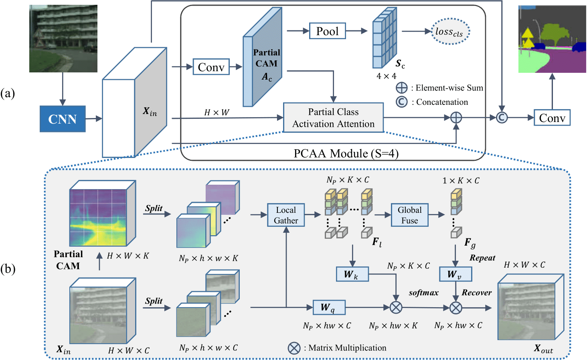

# PCAA for Semantic Segmentation
This repository is for *Partial Class Activation Attention for Semantic Segmentation* (to appear in CVPR 2022),

by Sun-Ao Liu, Hongtao Xie, Hai Xu, Yongdong Zhang, and Qi Tian.

Source code will be available soon!

## Introduction
For the first time, this paper explores modeling pixel relation via Class Activation Map (CAM). Beyond the previous CAM generated from imagelevel classification, we present Partial CAM, which subdivides the task into region-level prediction and achieves better localization performance. We further propose Partial Class Activation Attention (PCAA) that simultaneously utilizes local and global class-level representations for attention calculation. Notably, our method achieves state-of-the-art performance on several challenging benchmarks.

  

